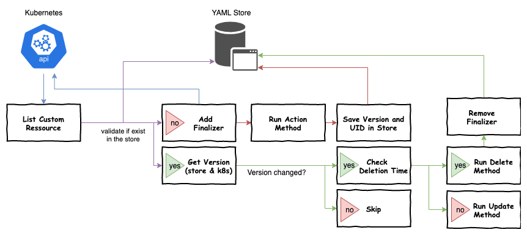

# Ruby Kubernetes Operator
If you do not want to create your operators for kubernetes in golang, it is difficult to find good frameworks. This gem is used to implement a few basic functions andand helps eucht with a quick entry into the world of operators. Unlike the operator-sdk in golang, the gem does not offer yaml generators. You would have to create the crds.yml yourself.<br>

## Current features

- Basic: Watch changes of custom resources and trigger upsert (add, update) or delete methods.
- Cache resource version in yaml store to avoid double events.
- Handle the finalizer on create and after delete events.
- Update status after successfuly passed upsert methods.
- Provides an event handler, so you can easy create events forcustom resources. On deletion it also will clean up all lost events.



## Installation
The gem is hosted on [rubygems.org](https://rubygems.org/gems/kubernetes-operator), so you can install it with ...
```
gem install kubernetes-operator
```
... or with bundler in your Gemfile.
```
source 'https://rubygems.org'
gem 'kubernetes-operator'
```

## Usage
An full example you will found in [./example](./example), also you can check our [yard](https://tobiaskuntzsch.gitlab.io/kubernetes-operator/) documentation.

### Watch events
The simplest start is an operator who only listens to the upsert events and writes the status in a logfile.

```
crdGroup = "exmaple.com"
crdVersion = "v1alpha1"
crdPlural = "myres"

def my_custom_action(obj,k8sclient)
    puts "Do some cool stuff for #{obj["metadata"]["crd_status"]} action of #{obj["metadata"]["name"]}"
end

opi = KubernetesOperator.new(crdGroup,crdVersion,crdPlural)
opi.setUpsertMethod(method(:my_custom_action))
opi.run()
```

You can also add an delete methode.

```
...

def my_custom_action_fordelete(obj,k8sclient)
    puts "Delete #{obj["metadata"]["crd_status"]} action of #{obj["metadata"]["name"]}"
end

...

opi.setDeleteMethod(method(:my_custom_action_fordelete))
opi.run()
```
### Return status subressources
If you have activated the subresource status in your crd, you can return a status `[:status]` object.<br><br>
Example resource definition:
```
spec:
  ...
  subresources:
    status: {}
  ...
  validation:
    openAPIV3Schema:
      properties:
        ...
        status:
          type: object
          properties:
            message:
              type: "string"
              minimum: 1
```
Example upsert method:
```
def upsert(obj,k8sclient)
    {:status => {:message => "upsert works fine"}}
end
```
Result:
```
Status:
  Message:  upsert works fine
```
### Logging
The operator framework generates an Log4r::Logger, you can also use this to send logs.
```
@logger = opi.getLogger()
@logger.info("create new fancy sample with the name #{obj["spec"]["sampleName"]}")
```
### Events
You can add events to your custom resource by using the EventHelper.
```
@eventHelper = opi.getEventHelper()
@eventHelper.add(obj,"fancy sample event")
```
Result:
```
Events:
  Type    Reason  Age   From                Message
  ----    ------  ----  ----                -------
  Normal  Upsert  36s   KubernetesOperator  fancy sample event
```